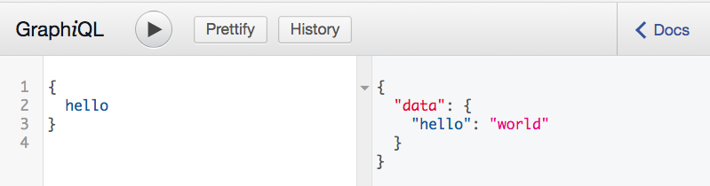

Getting started
============================================

Install
-------

Download or clone the repo_ and navigate to the directory.
::

    pip install django-graph-api

.. _repo: https://github.com/melinath/django-graph-api

In `settings.py`, add it to INSTALLED_APPS:
::

   INSTALLED_APPS = [
       ...
       'django_graph_api',
   ]

Create a basic schema
---------------------

GraphQL APIs require a graph-like schema
and at least one entry-point (query root) to the graph.

Here is an example of a schema with a single node.

In a new file named ``schema.py``:
::

    from django_graph_api import Schema
    from django_graph_api import CharField

    class QueryRoot(Object):
        hello = CharField()

        def get_hello(self):
            return 'world'

    schema = Schema(QueryRoot)

Set up a url to access the schema
---------------------------------

GraphQL APIs use a single url endpoint to access the schema.

In your ``urls.py``:
::

    from django_graph_api import GraphQLView
    from schema import schema

    urlpatterns = [
        ...
        url(r'^graphql$', GraphQLView.as_view(schema=schema)),
    ]

This url does two things:

1. Handles GraphQL AJAX requests
2. Displays the GraphiQL (graphical) application

Query the schema
----------------

GraphQL queries have a JSON-like structure and return JSON.

You should now be able to run the following query:
::

   {
      hello
   }

And receive the following response:
::

   {
      "data": {
         "hello": "world"
      }
   }

Using GraphiQL
^^^^^^^^^^^^^^

GraphiQL allows you
to run queries against your API
and see the results immediately.

In your browser,
go to ``localhost:8000/graphql`` to view it.

Using AJAX
^^^^^^^^^^

You can also query the schema
by sending a POST request
to the endpoint ``localhost:8000/graphql``
with the GraphQL query as the body.
